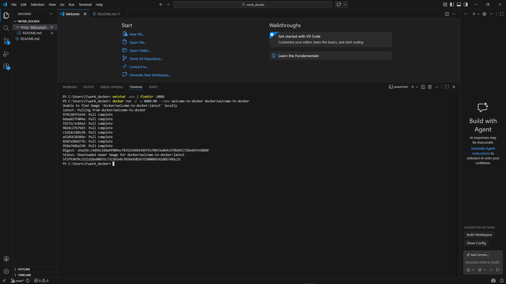
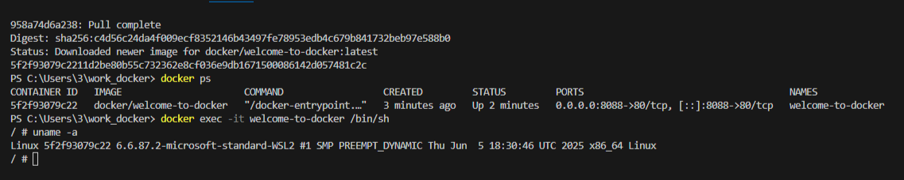
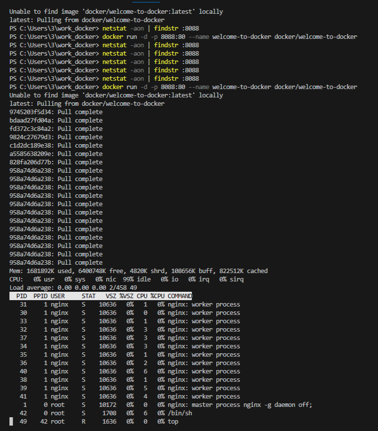
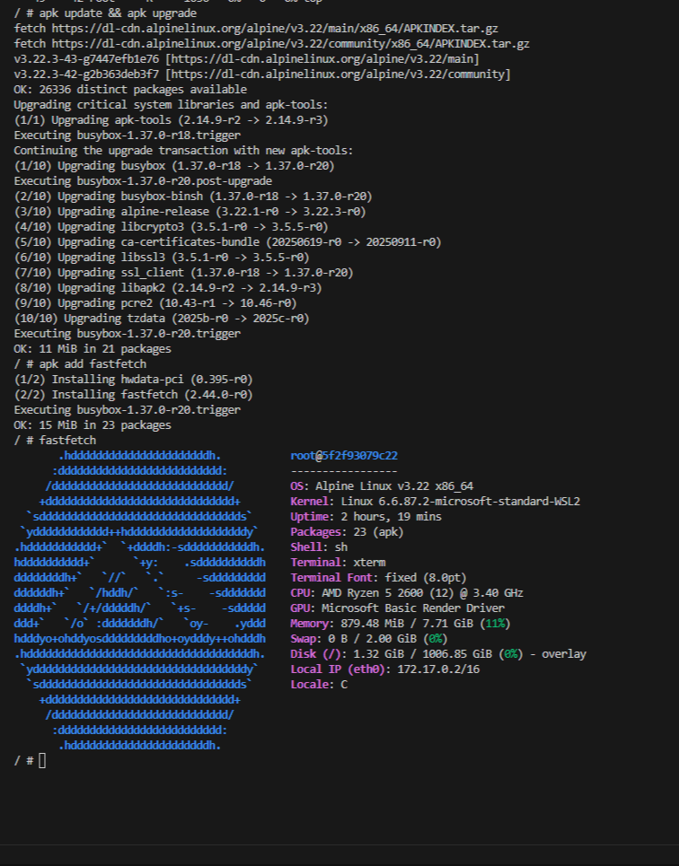

# 🐳 Welcome to Docker — Самостоятельная работа

## 📋 Описание задания
Запуск первого Docker-контейнера, выполнение базовых команд и документирование результатов.

---

## 🔧 Выполненные шаги

### 1. Проверка порта 8088
Перед запуском проверил, что порт свободен:
```powershell
netstat -aon | findstr :8088

 2. Запуск контейнера

docker run -d -p 8088:80 --name welcome-to-docker docker/welcome-to-docker




3. Проверка в браузере

Открыл http://localhost:8088:


4. Работа в контейнере

Информация об ОС

uname -a


Мониторинг процессов

top


 5. Установка fastfetch

apk update && apk upgrade
apk add fastfetch
fastfetch


📝 Выводы
✅ Успешно выполнен запуск Docker-контейнера
✅ Освоена работа с Alpine Linux
✅ Установлен fastfetch




