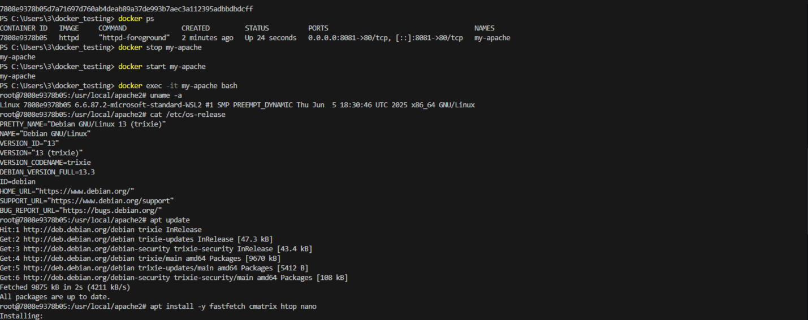
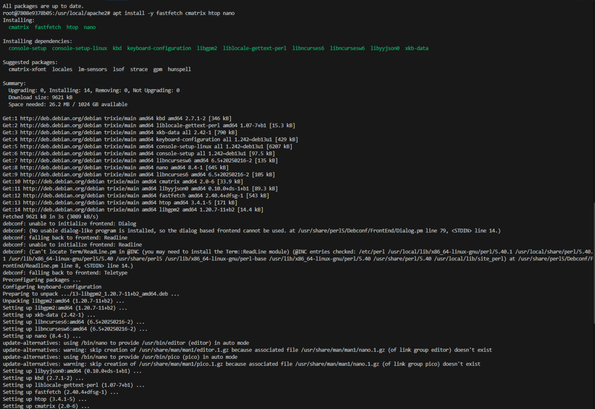
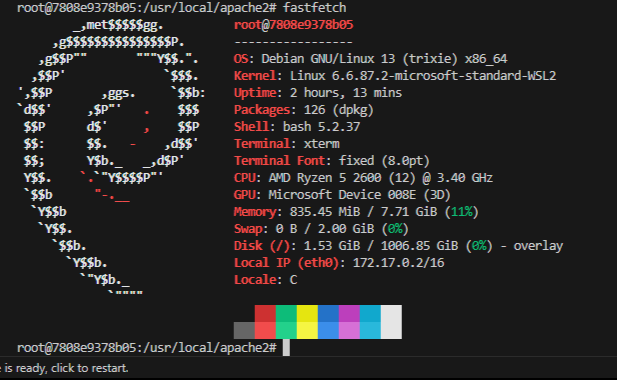

```markdown
# 🐳 Практическая работа с веб-сервером Apache в Docker

Это пошаговое руководство продолжает знакомство с Docker.  
Теперь мы развернём контейнер с **Apache** (официальный образ `httpd`), научимся управлять им, заходить внутрь, устанавливать утилиты и редактировать веб-страницу.

👉 [Предыдущая часть с Nginx](ссылка_на_предыдущий_README)

---

## 📋 Предварительные требования

- Установленный **Docker** (версия 20.10+)
- Базовое знакомство с командной строкой
- Порт `8081` на хосте свободен (проверить: `curl localhost:8081`)

---

## 🚀 Шаг 1: Запуск контейнера Apache

Официальный образ Apache называется **`httpd`**. Запустим контейнер с именем `my-apache` и пробросим порт хоста `8081` на порт контейнера `80`.

```bash
# Скачиваем образ (если его нет) и запускаем контейнер
docker run -d --name my-apache -p 8081:80 httpd
```


**Проверка:**  
```bash
docker ps
```
Откройте браузер и перейдите по адресу [http://localhost:8081](http://localhost:8081).  
Вы должны увидеть страницу **"It works!"** от Apache.


---

## 📊 Шаг 2: Управление и мониторинг

Базовые команды для работы с контейнером:

```bash
# Логи (потоковые)
docker logs -f my-apache
# Остановка
docker stop my-apache
# Запуск снова
docker start my-apache
# Перезапуск
docker restart my-apache
```

> 💡 Чтобы выйти из просмотра логов, нажмите `Ctrl+C`.

---

## 🔧 Шаг 3: Внутри контейнера – изучаем и устанавливаем утилиты

Зайдём внутрь работающего контейнера и превратим его в мини-лабораторию.

```bash
docker exec -it my-apache bash
```

Если `bash` отсутствует, попробуйте `sh`:

```bash
docker exec -it my-apache sh
```

### 🖥️ Информация о системе

```bash
uname -a
cat /etc/os-release
```
> Образ `httpd` обычно основан на **Debian**.

### 📦 Установка полезных утилит

Обновляем списки пакетов и ставим:

```bash
apt update
apt install -y fastfetch cmatrix htop nano
```



*Примечание:* в минимальных образах могут отсутствовать `hollywood` или `mc`, но `cmatrix`, `htop` и `nano` вполне доступны.

### 🎉 Запуск для демонстрации

```bash
fastfetch   # красивая информация о системе
cmatrix     # матричный дождь (выход: q)

```



### 🚪 Выход из контейнера

```bash
exit
```

---

## ✏️ Шаг 4: Редактирование веб-страницы Apache

Главное отличие от Nginx – путь к директории с сайтом.

1. **Снова заходим в контейнер**  
   ```bash
   docker exec -it my-apache bash
   ```

2. **Переходим в папку htdocs**  
   В Apache файлы лежат в `/usr/local/apache2/htdocs/`.  
   Проверим:
   ```bash
   ls /usr/local/apache2/htdocs/
   ```

3. **Редактируем index.html**  
   Если вы установили `nano` (или `micro`), откройте файл:
   ```bash
   nano /usr/local/apache2/htdocs/index.html
   ```

4. **Изменяем содержимое**  
   Вставьте следующий код (можно добавить свои эмодзи):
   ```html
   <!DOCTYPE html>
   <html>
   <head>
       <meta charset="UTF-8">
       <title>Моя страница Apache</title>
   </head>
   <body>
       <h1>Привет из контейнера Apache!</h1>
       <p>lets Go</p>
       
   </body>
   </html>
   ```

   *Сохранение в nano:* `Ctrl+O`, затем `Enter`, выход `Ctrl+X`.

5. **Проверяем результат**  
   Выйдите из контейнера (`exit`) и обновите страницу в браузере:  
   [http://localhost:8081](http://localhost:8081)
   

   Вы должны увидеть своё сообщение.

---

## 🧹 Шаг 5: Очистка (финал)

После завершения работы удалите контейнер и, при желании, образ.

```bash
# Остановка
docker stop my-apache

# Удаление контейнера
docker rm my-apache

# Удаление образа (по желанию)
docker rmi httpd
```

Чтобы удалить все неиспользуемые образы разом:
```bash
docker image prune -a
```

---


---

## 🎯 Итог

Вы успешно запустили Apache в Docker, зашли внутрь контейнера, установили дополнительные программы и изменили веб-страницу. Эти навыки универсальны и пригодятся при работе с любыми Docker‑образами.


